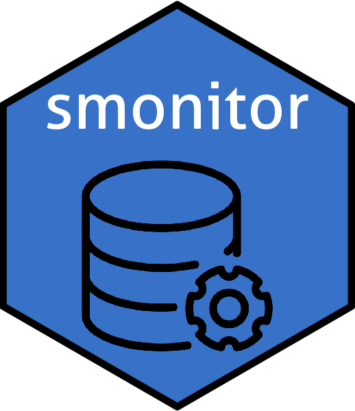

# **smonitor** <a href='https://github.com/skgrange/smonitor'></a>

[](https://www.tidyverse.org/lifecycle/)

## Introduction

**smonitor** is a framework, and a collection of functions which operate on this framework to allow for the maintenance of air quality monitoring data. **smonitor** is an R package which provides the things need to service a specific, but simple data model (also known as a schema) implemented with a SQL database. Although the development reflects the management of air quality monitoring data, the functions and data model are utilitarian enough to be applied to other types of time series measurements. 

## Installation

To install the development version the [**devtools**](https://github.com/hadley/devtools) package will need to be installed first. Then:

```
# Load package
library(devtools)

# Install dependencies
install_github("skgrange/threadr")
install_github("skgrange/databaser")

# Install smonitor
install_github("skgrange/smonitor")
```

## Example database

A minimal SQLite example of the database can be found at `inst/extdata/smonitor_example.db`. The addition of other variables/columns/fields in the tables will not cause problems, but the removal of the core variables is not recommended if the R functions within this package are to be used without modification. 

### Background

I have been involved with many projects that seriously the storage and retrieval of time series data, an example can be found [here](https://wiki.52north.org/SensorWeb/SensorObservationServiceVDatabaseModel). I believe that time series data are simple; at a fundamental level there are observations in time and space which need to be stored and most data models complicate this too much. In my experience, most of the complication arises when:

  - Many time series are turned on and off over time.
  
  - There are introductions of temporally overlapping time series. This can occur when multiple sensors monitoring the same variable are located at a single monitoring site. For example for a season, a number of NO<sub>x</sub> analysers operate at the same monitoring site for intercomparison activities. 
  
  - A number of aggregations usually need to be calculated. Aggregations often have a dependence on other aggregations and although the majority of aggregations are simple, there are a few which are rather tricky. 
  
  - Time series are almost never static. Observations in the past are often altered and new observations become available constantly. The growth and dynamic nature of time series needs management to ensure all updates and inserts can be handled easily and quickly.
  
  - A number of different data sources need to be accessed which almost always have different data structures and formats. *smonitor* gives a clear framework on how all observational data should be structured and stored allowing for the access of any data source in the same way.
  
  - The use of metadata. Although time series data are simple in their nature, a number of extra pieces of information often need to be stored and used, at least sometimes during analysis. 
  
**smonitor** attempts to provide a framework and functions so these things can be dealt with easily which leads to getting data into and out of a database being simple and fast. 
## Objectives

The primary objectives of **smonitor** are: 

  - Provide a simple core data model for time series data. The data model should allow for extensions for specific uses. 
  
  - Provide functions to insert data and calculate aggregations which can be easily scheduled and be dynamic. This allows the database to reflect source data changes which occurs constantly with time series measurements. 
  
  - Provide importing functions so data can be imported and used easily and conveniently for analysis and data delivery. 
  
    - This is the end goal and the key reason why this development was started, accessing good quality data should be easy. 

## The data model

The current data model is implemented with seven core tables and uses generic nouns and verbs to keep things portable. The tables are:

  - `processes`: Stores information of unique time-series. `processes` contains keys to join all other tables together and is the main mapping table. 
  
  - `sites`: Stores information of monitoring locations/facilities such as names, identifiers, addresses, and coordinates. This table can be a spatial table. 
  
  - `aggregations`: Stores information of aggregation functions and methods.
  
  - `summaries`: Stores information of what aggregations should be performed on processes. 
  
  - `invalidations`: Stores date ranges where a process is considered invalid. An optional component and is only really used when source data obviously contains errors. 
  
  - `calibrations`: Stores calibration coefficients for processes. An optional component which has not be formally integrated yet. 
  
  - `observations`: Stores measurement data as well as the aggregations of measurement data.

An entity-relationship diagram of the core data model looks like this:


The data model has some constraints, but by design, they have been used sparingly. The **smonitor** data model contains a bit of replication regarding `site` and `variable` variables. These variables are unneeded outside the `processes` table but are included to help when building look-up tables and to help with the decoding of the integer keys.

### A `process`

The primary identifier for a location-variable pair is called the `process`. A `process` is best described as a unique, and usually, an uninterrupted time series. For example, a temperature sensor at a monitoring site for several years would represent a single process. If relative humidity and pressure were also monitored at the same location, they would form other processes. Other variables at other monitoring sites/locations would also be additional processes. However, if the original temperature sensor failed and was replaced, the replacement would be a new process. Changes in instrumentation would usually give cause to create a new process, but if instrumentation contains consumables, such as BAMs (beta attenuation monitors) with their filter tape, new processes could be used to represent these changes too; but only if this was desired. A process can be as granular as a user needs it to be. Processes are defined in space via the `sites` table and by time by their entries in the `observations` table. 

### A `summary`

The **smonitor** data model allows *n* number of summaries to be associated with a process. A summary would usually represent an aggregation method such as a daily mean or a daily maximum. For example, a temperature sensor at a location is set to log data every minute and this is retrieved and stored in a database as a single `process`. Perhaps one-minute data are not useful for most people and hourly means wish to be reported. The process will remain the same, but the hourly aggregated observations would represent a different summary. The same situation would occur for other summaries such as daily averages, daily minimums, and daily maximums. **smonitor** contains functions which enable these aggregations to be done on processes once they have been inserted into the `observation` table. 

## Uses

**smonitor** is used for many pieces of my work including: 

  - A domestic weather station database. 
  
  - Personal database containing New Zealand's air quality monitoring data. 
  
  - Personal database containing United Kingdom's [AURN](https://uk-air.defra.gov.uk/) (Automatic Urban and Rural Network) data and meteorological data sourced from NOAA's Integrated Surface Database ([ISD](https://www.ncdc.noaa.gov/isd)). 
  
  - A database which contains a handful of sites which is serviced by the [**envirologgerr**](https://github.com/skgrange/envirologgerr) API.
  
  - A database containing European Economic Area (EEA) member state's [AirBase](http://www.eea.europa.eu/data-and-maps/data/airbase-the-european-air-quality-database-8) and [e-Reporting](http://cdr.eionet.europa.eu/) air quality observations. This database represents a very large amount of work by many of the European states and contains 12 800 sites, 170 000 processes, and 4 100 000 000 time-series observations. The database technology used for this application is [PostgreSQL](https://www.postgresql.org/). The only extensions required to **smonitor** for this project were to add a handful of new variables to the `sites` table and a dozen more to the `processes` table. The other deviation is that every aggregation period forms its own process. Therefore, there are no summaries calculated from processes which makes the database "flatter" and simpler. However, this change required some modification of the importing functions to get data out of the database after it has been inserted. 

  - A database containing observations from a CO<sub>2</sub> sensor network for the [ICOS Cities](https://www.icos-cp.eu/projects/icos-cities) project. This database requires the use of several extra variables in the `processes` and `sites` tables as well as a number of additional tables (such as `sensors`, `cylinder_test_summaries`, `calibration_coefficients`, and `observation_flagging_conditions`) to handle the sensor network operations correctly - especially those relating to calibration activities. 
  